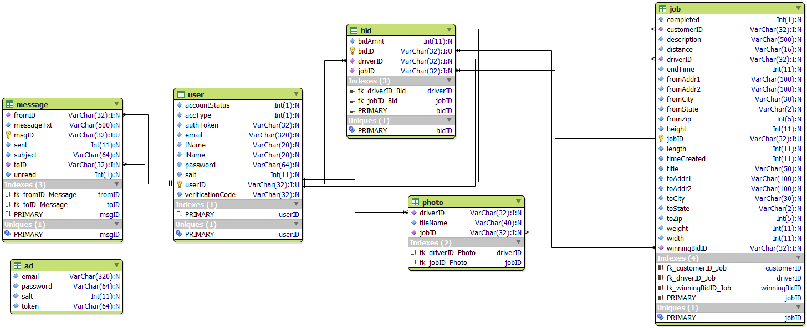

## Dependencies

- pandoc

- texlive

- LWP

- DBI

- Crypt::Digest::SHA256

- Crypt::Digest::MD5

- Business::PayPal::EWP

## Account Types

- 0 : Customer

- 1 : Driver

## Account Status Codes

- -1 : Customer, email not verified

- 0 : Customer, email verified

- 1 : Driver, application pending

- 2 : Driver, application approved, no jobs completed
  
- 3 : Driver, active

- 4 : Driver, account locked

- 5 : Driver, application approved, no jobs completed, account locked

- 6 : Customer, email not verified, account locked

- 7 : Customer, email verified, account locked

## Auction Type

- 0 : Auction

- 1 : "Buy it now"

## Order Status Codes

- 0 : Auction

- 1 : Auction Completed, Payment Pending

- 2 : Payment Received

- 3 : Auction Completed, no bids

- 4 : Auction Completed, winning bid not chosen yet

- 7 : Completed

- 8 : Cancelled

## URL Status Codes

- EMAILERROR : Email already in use

- PASSERROR : Password Incorrect

- PASSMATCHERROR : Passwords do not match (password + password\_ver)

- FIELDERROR : Required field left blank

## Entity Relationship Diagram

Note: The ERD was generated on Windows. MariaDB on Windows apparently enforces
all-lowercase for table names. As such, the capitalization of table names in the
diagram are incorrect.
